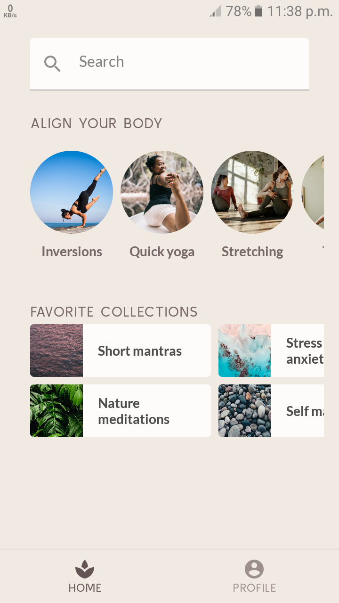

## MySoothe App

MySoothe is a well-being app that lists various ways to improve your body and mind. It contains a
section that lists your favorite collections, and a section with physical exercises. This is what
the app looks like:

## Screenshots

Through implementing a real-world design, I learned about
--------------

- modifiers,
- alignments,
- arrangements,
- Lazy layouts,
- slot APIs,
- scrolling,
- and Material components.